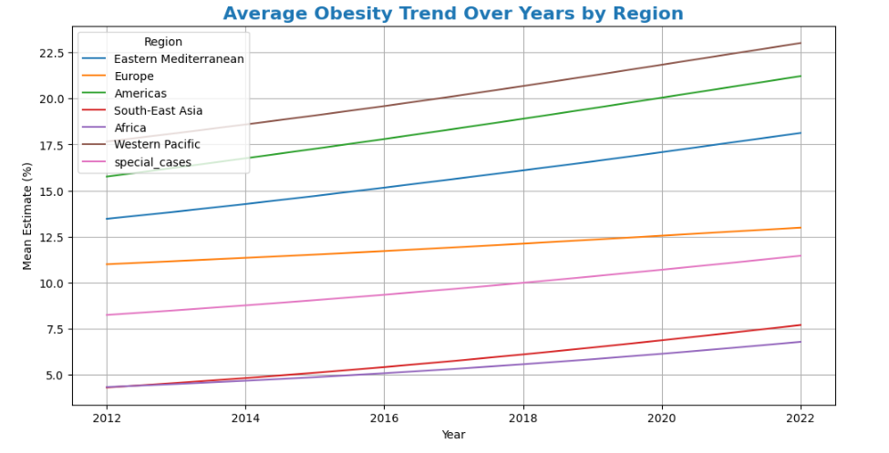
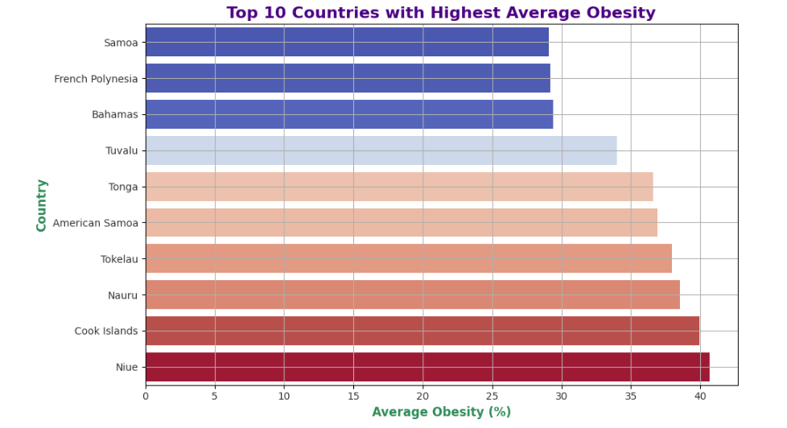
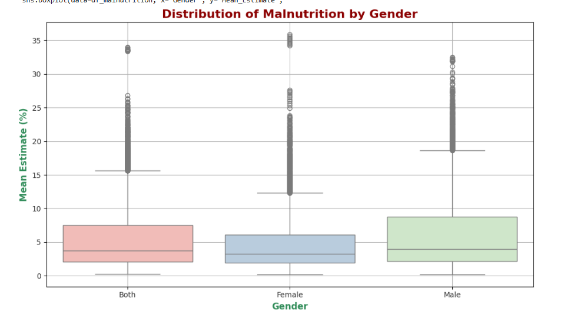
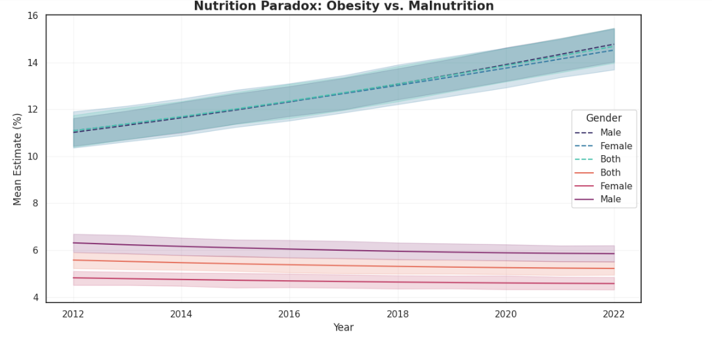
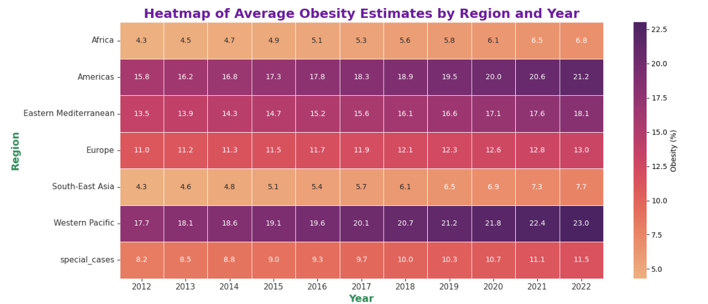
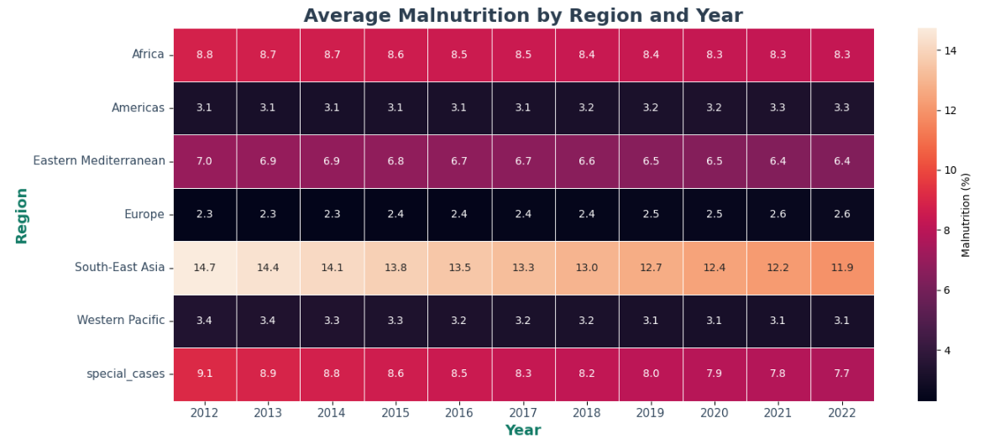

# ⚖️ Nutrition Paradox: A Global View on Obesity and Malnutrition

## 🌍📊 Project Overview

The **Nutrition Paradox** project is a comprehensive data analysis initiative that explores the complex global challenge of coexisting undernutrition and overnutrition across different countries, age groups, and genders. Using publicly available WHO data, this project uncovers trends, patterns, and disparities in obesity and malnutrition rates worldwide.
This comprehensive analysis examines global nutrition trends from 2012-2022, focusing on the dual burden of obesity and malnutrition across different regions, countries, and demographic groups. The project demonstrates the "nutrition paradox" - where obesity and malnutrition can coexist within populations.

## 🛠 Technologies Used

### Programming & Libraries


### Database & SQL


### Visualization & Dashboards


### Additional Tools


### 🎯 Objectives
- Investigate undernutrition and overnutrition patterns globally
- Analyze demographic disparities across countries, age groups, and genders
- Provide data-driven insights for global health strategies
- Create interactive visualizations and dashboards for stakeholders

## 📣 Problem Statement

Imagine you are a Data Analyst working for a global health organization. Your task is to investigate the complex challenge of undernutrition and overnutrition across different countries, age groups, and genders. You will use publicly available WHO data to uncover trends, patterns, and disparities in obesity and malnutrition rates around the world. Your end goal is to derive meaningful insights that can inform global health strategies and help tackle the nutritional paradox of rising obesity and persistent malnutrition.

## 💼 Business Use Cases

### 🚨 Nutrition Risk Monitoring
- Identify countries with extremely high obesity or malnutrition levels
- Flag regions for public health intervention priorities

### 👥 Demographic Disparity Analysis  
- Understand gender and age group contributions to nutrition statistics
- Analyze vulnerable population segments

### 📊 Data-Driven Policy Planning
- Help policymakers prioritize regions for funding
- Support nutrition-related program development

### 🌐 Comparative Region Analysis
- Enable researchers to compare regional trends
- Draw correlations between health indicators and socio-economic conditions

### 📈 Public Health Reporting
- Provide government and NGOs with comprehensive dashboards
- Display country-level nutrition trends and insights

## 📊 Dataset Information

### Data Sources
The project utilizes 4 WHO API endpoints providing nutritional indicators:

**Obesity Datasets:**
- `NCD_BMI_30C` - Obesity among adults (BMI ≥ 30)
- `NCD_BMI_PLUS2C` - Obesity/Overweight among children

**Malnutrition Datasets:**
- `NCD_BMI_18C` - Underweight in adults (BMI < 18.5)
- `NCD_BMI_MINUS2C` - Thinness in children

### Data Coverage
- **Time Period**: 2012-2022
- **Geographic Coverage**: Global (WHO regions and member countries)
- **Demographics**: Adults and Children/Adolescents by gender
- **Metrics**: Estimates with confidence intervals

## 🚀 Installation & Setup

### Prerequisites
- Python 3.8 or higher
- Git
- SQL Database (SQLite/MySQL/PostgreSQL)

### Clone Repository
```bash
git clone https://github.com/VasanthPrakasam/Project-Nutrition-Paradox-A-Global-View-on-Obesity-and-Malnutrition.git
cd Project-Nutrition-Paradox-A-Global-View-on-Obesity-and-Malnutrition
```

### Database Setup
```bash
# For MySQL/PostgreSQL
# Update connection parameters in config files
python src/database_operations.py --setup-mysql
```

## 🔄 Project Workflow

### Phase 1: Data Collection & Preprocessing
1. **Data Extraction**: Fetch data from 4 WHO API endpoints
2. **Data Cleaning**: Handle missing values, standardize formats
3. **Feature Engineering**: Create new columns (age_group, CI_Width, levels)
4. **Country Code Conversion**: Convert ISO codes to full country names

### Phase 2: Exploratory Data Analysis
1. **Descriptive Statistics**: Summary statistics for all variables
2. **Trend Analysis**: Time series analysis (2012-2022)
3. **Geographic Analysis**: Regional and country-level patterns
4. **Demographic Analysis**: Gender and age group comparisons

### Phase 3: Database Implementation
1. **Schema Design**: Create optimized table structures
2. **Data Insertion**: Load cleaned data into SQL databases
3. **Query Development**: Write 25 analytical SQL queries
4. **Performance Optimization**: Index creation and query tuning

### Phase 4: Visualization & Dashboard
1. **Python Visualizations**: Create 7-12 analytical charts
2. **Dashboard Development**: Build interactive dashboards
3. **Insight Generation**: Extract actionable insights
4. **Report Creation**: Comprehensive analysis reports

## ✨ Key Features

### 🧹 Data Processing Pipeline
- Automated data extraction from WHO APIs
- Comprehensive data cleaning and validation
- Feature engineering with domain-specific metrics
- Country code standardization using pycountry

### 📊 Advanced Analytics
- 25 SQL queries covering various analytical perspectives
- Statistical analysis with confidence intervals
- Trend analysis across multiple dimensions
- Comparative analysis between regions and demographics  

### 📈 Interactive Visualizations
- Time series plots for trend analysis
- Geographic heat maps for regional insights
- Demographic comparison charts
- Distribution analysis with box plots and histograms

### 🎯 Business Intelligence
- Executive dashboards for stakeholders
- Automated alert systems for high-risk regions
- Performance metrics and KPIs
- Export capabilities for reports and presentations

## 📊 Results & Insights

### 🌍 Global Trends
- **Obesity Epidemic**: Rising obesity rates across developed nations
- **Persistent Malnutrition**: High malnutrition rates in developing regions
- **Demographic Disparities**: Significant gender and age-based variations

### 🎯 Key Findings
- Countries with dual burden of malnutrition and obesity
- Regional hotspots requiring immediate intervention
- Most vulnerable demographic groups identified
- Data reliability assessment across regions

### 📈 Actionable Recommendations
1. **Priority Regions**: Focus on Sub-Saharan Africa and South Asia
2. **Targeted Interventions**: Gender-specific nutrition programs
3. **Policy Framework**: Evidence-based policy recommendations
4. **Monitoring System**: Continuous surveillance of nutrition indicators

## 🖼 Project Visualizations & Screenshots

### 📈 Trend Analysis Visualizations

*Global obesity trends from 2012-2022 showing increasing rates across developed nations*


*Regional malnutrition trends highlighting persistent challenges in Sub-Saharan Africa and South Asia*


*Comparative analysis showing the nutrition paradox - simultaneous rise in obesity and persistent malnutrition*

### 👥 Demographic Analysis Charts

*Gender disparities in obesity and malnutrition rates across different regions and age groups*


*Demographic breakdown of obesity indicators by WHO regions*


*Demographic breakdown of nutrition indicators by WHO regions*

## 🖼 Dashboard Screenshots

### Power BI Dashboard

*Interactive overview of global nutrition trends*


*Regional breakdown of obesity rates*


*Regional breakdown of malnutrition rates*

## 🔮 Future Enhancements

### 📊 Additional Data Sources
- Integrate socio-economic indicators
- Include food security metrics
- Add healthcare accessibility data

### 🤖 Advanced Analytics
- Machine learning predictive models
- Clustering analysis for country groupings
- Time series forecasting

### 🌐 Enhanced Visualizations
- Real-time data updates
- 3D geographic visualizations
- Mobile-responsive dashboards

### 🔗 Integration Capabilities
- API development for data access
- Integration with health information systems
- Automated reporting systems

## 🤝 Contributing

We welcome contributions to improve this project! Here's how you can help:

### Getting Started
1. Fork the repository
2. Create a feature branch (`git checkout -b feature/AmazingFeature`)
3. Commit your changes (`git commit -m 'Add some AmazingFeature'`)
4. Push to the branch (`git push origin feature/AmazingFeature`)
5. Open a Pull Request

### Contribution Guidelines
- Follow PEP 8 style guidelines for Python code
- Add appropriate comments and documentation
- Include unit tests for new features
- Update README.md for significant changes

### Areas for Contribution
- Data preprocessing improvements
- New visualization types
- Additional SQL queries
- Dashboard enhancements
- Documentation improvements

## 📞 Contact

### Project Author
**Vasanth Prakasam**
- GitHub: [@VasanthPrakasam](https://github.com/VasanthPrakasam)
- LinkedIn: [Connect with me](https://linkedin.com/in/vasanthprakasam)
- Email: vasanthprakasam@example.com

### Project Links
- **Repository**: [GitHub Link](https://github.com/VasanthPrakasam/Project-Nutrition-Paradox-A-Global-View-on-Obesity-and-Malnutrition)
- **Live Dashboard**: [View Dashboard](https://your-dashboard-link.com)
- **Documentation**: [Project Wiki](https://github.com/VasanthPrakasam/Project-Nutrition-Paradox-A-Global-View-on-Obesity-and-Malnutrition/wiki)

---

## 🙏 Acknowledgments

- **World Health Organization (WHO)** for providing open access to global health data
- **Global Health Community** for continuous research and insights
- **Data Science Community** for tools and methodologies
- **Project Mentors** for guidance and support

## 📊 Project Statistics


---

**⭐ If you found this project helpful, please give it a star!**

*Last Updated: August 2025*
